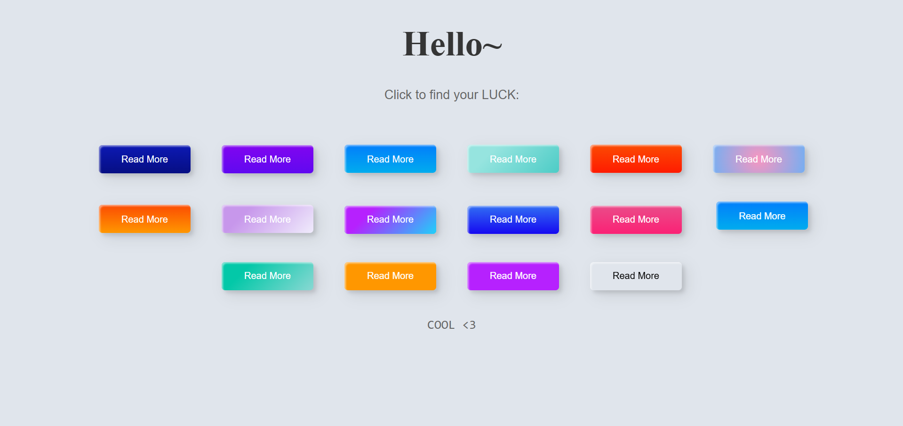
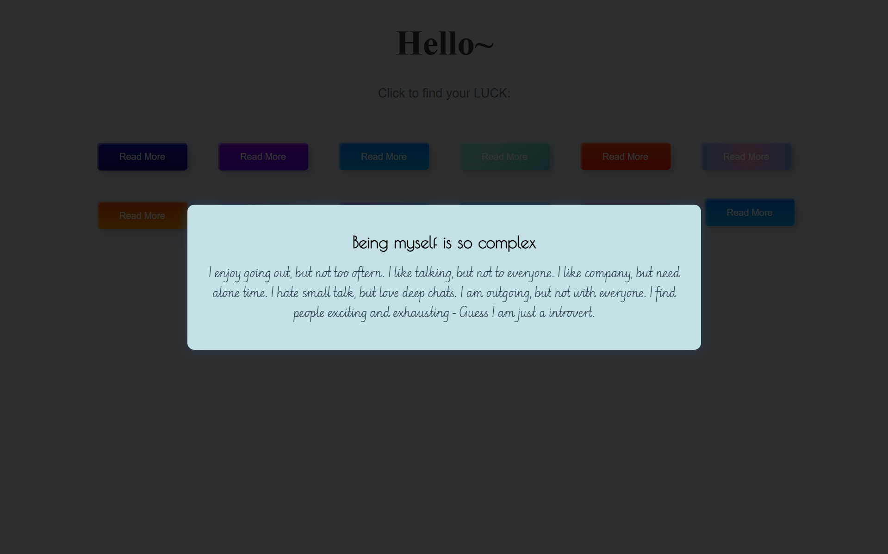

# 🎯 ButtonClick – 16 Buttons, 16 Stories  
A fun and colorful interactive project where **every click tells a story**.  
Click any of the 16 vibrant buttons and reveal a little piece of personality, thoughts, or relatable truths.  

Check it out: https://catheringino.github.io/ButtonClick/

---

## ✨ Features
- **16 Unique Buttons** – Each with its own gradient color and vibe.  
- **Surprise Texts** – Every click reveals a short, heartfelt, or thought-provoking message.  
- **Smooth Popup Display** – Messages appear in a neat, centered modal for focus.  
- **Responsive Layout** – Works beautifully on desktop and mobile.  

---

## 📸 Preview  
### Home Screen  
  

### Clicked Popup  
  

---

## 🛠 How It Works
1. **Load the page** – You’re greeted with 16 colorful “Read More” buttons.  
2. **Click a button** – A modal pops up with a unique message.  
3. **Enjoy the surprise** – Each button tells a different mini-story.  

---

## 🚀 Getting Started

### 1. Clone the repository
```bash
git clone https://github.com/CatherinGino/ButtonClick.git
```

### 2. Open in your browser
Simply double-click the `index.html` file. No extra setup needed!

---

## 📂 Project Structure
```
ButtonClick/
│
├── index.html      # Main page with 16 buttons
├── style.css       # Beautiful gradients, layouts, and modal styling
├── script.js       # Button click logic and popup control
└── assets/         # Images/screenshots
```

---

## 🎨 Tech Stack
- **HTML5** – Structure of the page
- **CSS3** – Styling, gradients, and button effects
- **JavaScript** – Popup interaction and button click handling

---

## 💡 Example Messages
- *"Being myself is so complex..."*  
- *"I enjoy going out, but not too often..."*  
- *"I hate small talk, but love deep chats..."*  

---

## 🧠 Why I Made This
I wanted to create a **simple yet engaging** project that makes people smile when they click a button.  
The goal is to make each click feel **personal and relatable** – like a fortune cookie, but cooler.  

---

## ❤️ Contributing
If you have ideas for new button colors or fun messages, feel free to:
1. Fork this repo  
2. Add your ideas  
3. Make a pull request  

---

## 📜 License
This project is licensed under the MIT License – feel free to use, modify, and share.
